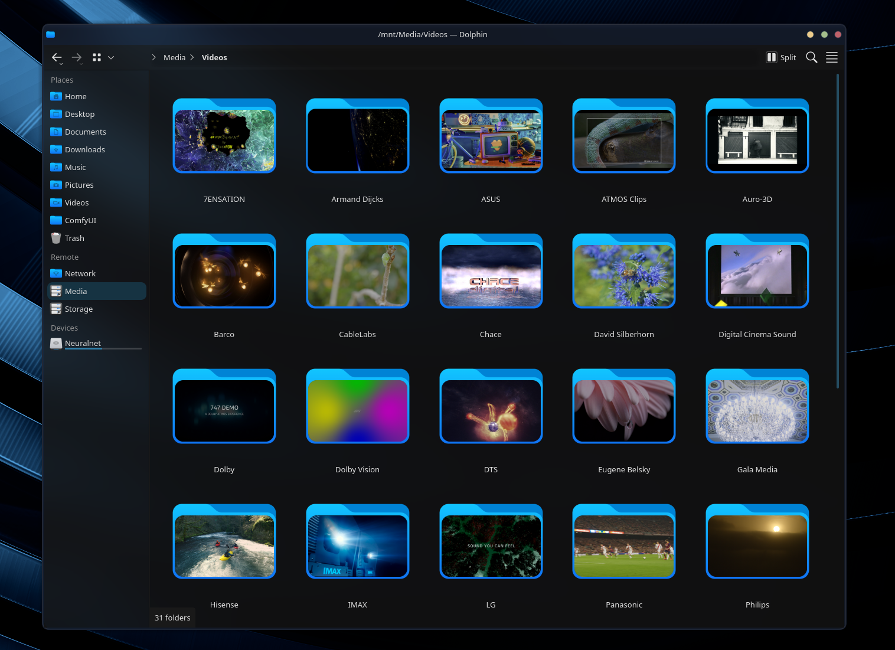

# CachyOS-Tools
A grab bag of different tools and service menus I've made for myself.

Each tool folder (except `utils/`) has its own `install.sh` that copies the
script into `~/.local/bin/` and, if it has one, its `.desktop` service menu
into `~/.local/share/kio/servicemenus/` (patching the `[USER]` placeholder
with your username). Run it from inside the folder:

```sh
cd generate_folder_thumbnails && ./install.sh
```

## Tools:

### generate_folder_thumbnails
Uses Dolphin's service menus to add a right-click menu to generate user customizable thumbnails per subfolder found.  If the media are clips, we use ffmpeg to generate a thumbnail at the 50% mark.  You can use your own folder icon and modify the image position by modifying the script.  A convert SVG to PNG script is provided in utils to allow using any Icon Pack and generating the needed png.  [README](generate_folder_thumbnails/README.md)




### group_files

Dolphin right-click menu to group selected files into a new subfolder. Can be used as a Dolphin Keyboard Shortcut if prefered. [README](group_files/README.md).

### navigate_sibling

Go to the next/previous sibling folder. This tool allows quickly navigating subfolders, without the need to go back up, select next folder and then in that next folder. Simply press an Up or Down shortcut to quickly move across the hierarchy. Meant to be bound to a keyboard shortcut inside Dolphin itself (Settings > Configure Keyboard Shortcuts).  `install.sh` also enables Dolphin's "Show full path in title bar" setting, which the script relies on. [README](navigate_sibling/README.md) 

### paste_into

Paste clipboard files into the folder selected in the active Dolphin window. Meant to be bound to a keyboard shortcut inside Dolphin itself (Settings > Configure Keyboard Shortcuts), not a KDE Global Shortcut, so other apps don't lose access to the same key combination. [README](paste_into/README.md).

### utils

Standalone helper scripts, no need to install. [README](utils/README.md).

